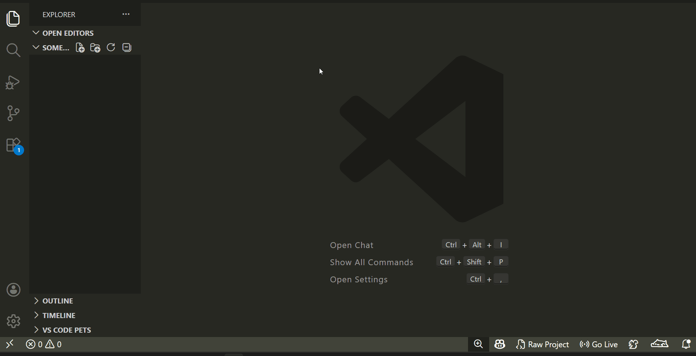
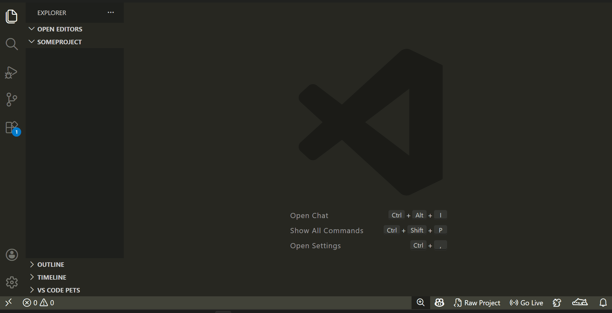
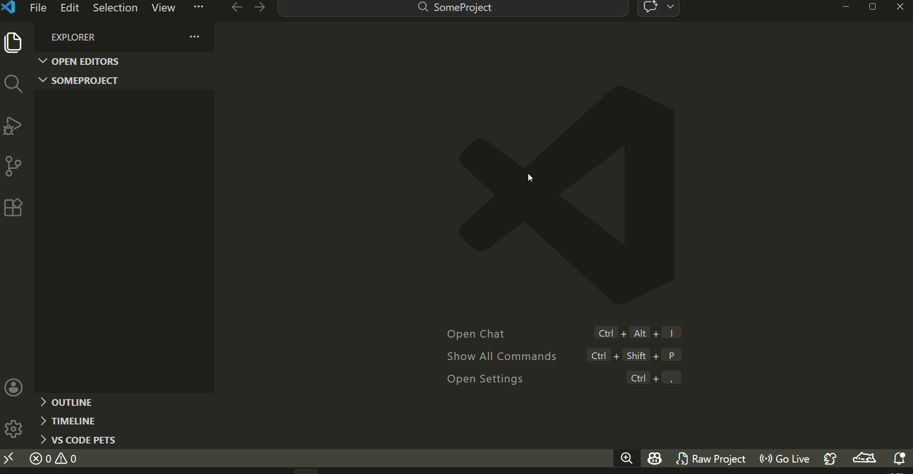

# RapidStart Web Generator

## Overview

Rapidly initialize vanilla web projects with customizable HTML, CSS, and JS boilerplate. Whether you're starting a new project or a quick demo, this extension streamlines your workflow by generating the essential structure in seconds.

## Features

- **One-Click Initialization**: Generate a complete `index.html`, `style.css`, and `script.js` directly from the status bar.
- **Explorer Integration**: Right-click any folder in the Explorer and select **"Create Raw Project"** to initialize in that specific location.
- **Customizable Templates**: Fully customize the generated code snippets through VS Code settings.
- **Live Preview Integration**: Automatically trigger Live Server to preview your creation immediately.
- **TypeScript Powered**: Robust and performant core built on modern VS Code APIs.

## How to Use

### Via Status Bar

1. Open a workspace folder.
2. Click the `$(file-code) Raw Project` icon in the right side of the status bar.
3. Boilerplate files will be created and `index.html` will open automatically.

  

### Via Explorer Context Menu

1. Right-click any folder in the Side Bar.
2. Select **"Create Raw Project"**.
3. The project will be initialized inside the selected folder.

  

### Via Command Palette

1. Press `F1` or `Ctrl+Shift+P` to open the Command Palette.
2. Type **"Rapid"**.
3. Select **"RapidStart: Create Vanilla Project"**.

  

## Technical Details

### Generated Boilerplate

The extension generates a clean, modern structure:

- `index.html`: Modern HTML5 boilerplate with pre-linked CSS and JS.
- `css/style.css`: Basic CSS reset and container utilities.
- `js/script.js`: Clean entry point with a verification log.

### Extension Settings

Modify templates by navigating to `File > Preferences > Settings` and searching for `htmlGenerator`:

- `htmlGenerator.customHtmlTemplate`: Override the default HTML boilerplate.
- `htmlGenerator.customCssTemplate`: Override the default CSS styles.
- `htmlGenerator.customJsTemplate`: Override the default JavaScript logic.

## Dependencies

This extension works best with the [Live Server](https://marketplace.visualstudio.com/items?itemName=ritwickdey.LiveServer) extension for real-time previewing.

## Installation

1. Open **Visual Studio Code**.
2. Go to the **Extensions** view (`Ctrl+Shift+X`).
3. Search for **RapidStart Web Generator**.
4. Click **Install**.

## Contributing

Contributions are welcome! If you have suggestions or find bugs, please feel free to:

1. Fork the [repository](https://github.com/DHayk87/RapidStart-Vanilla-Web-Generator).
2. Create a feature branch.
3. Submit a Pull Request.

## License

This project is licensed under the [MIT License](https://opensource.org/license/mit).

---

## Changelog

See [CHANGELOG.md](CHANGELOG.md) for a list of recent changes.
